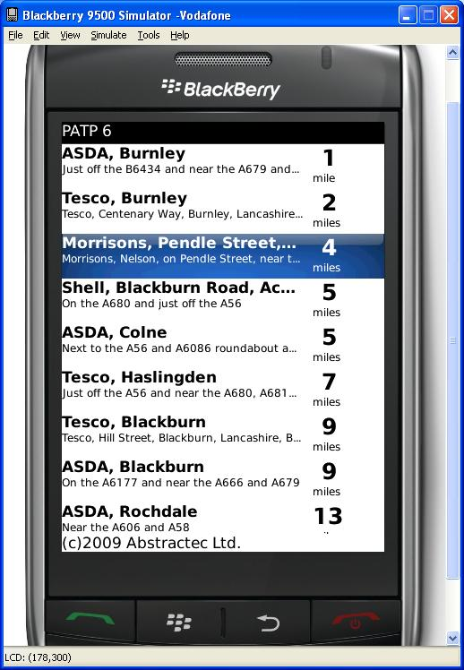

# Blackberry Pay At The Pump App
The code for a very old project I worked on that never made production, Blackberry Pay At The Pump app for Abstractec.  The code is old don't judge.

Just adding this here so people can have a look at some old blackberry code referenced from my blog post...

http://www.kayley.name/2010/06/28/pay-at-the-pump-and-lpg-finder-for-blackberryr/

Pay At The Pump and LPG Finder for BlackBerry(R)
For the past few months on and off I’ve been working on a project for my friend and former colleague John Haselden of Abstractec. He has made a website and an iPhone phone application which utilises web services of the website. The project is called Fuelista, and the applications are Pay at the Pump and iPayAtThePump for iPhone, (with variants for LPG etc).

The idea of the Pay at the Pump and LPG Finder applications is to provide a location based service to allow you to find petrol stations that provide a “pay at the pump” or “LPG” service. The application does a GPS lookup on your location, and returns a list of garages that provide that service. You can then navigate through and get more details of the garage, and if you require you can a route from your current location to the garage.

Abstractec are trying out more platforms than just the iPhone. They are investigating Android, BlackBerry and PalmPre. I was asked if I would like a go at the BlackBerry port, so I thought “why not?”

I wanted to get into writing iPhone applications for fun and maybe a bit of extra cash, I bought myself a Macbook Pro and an iPhone in mid 2009, but there is a lot to learn to get up and running with iPhone development, the applications are written in Objective-C and the development environment is quite difficult to get your head around when you’re starting off, especially coming from a Java background.
BlackBerry applications however are written using Java.

Research In Motion (RIM) provide a layer on top of J2ME providing their own classes and UI components specifically for the BlackBerry handsets.

The application is complete and also I have created the LPG equivalent. Check out the video below for a demo of the application. The GPS lookup on the handset that I have to test with is quite poor…Hence the timeout when the first lookup occurs.

Enjoy…

https://youtu.be/qRBemxmqxPk

